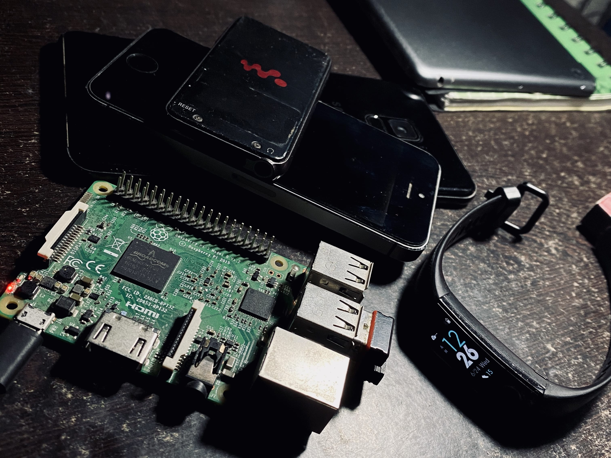
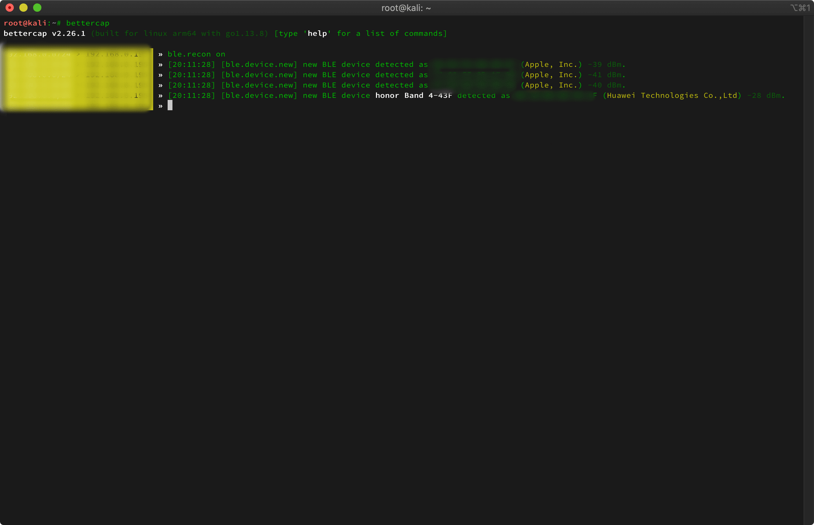
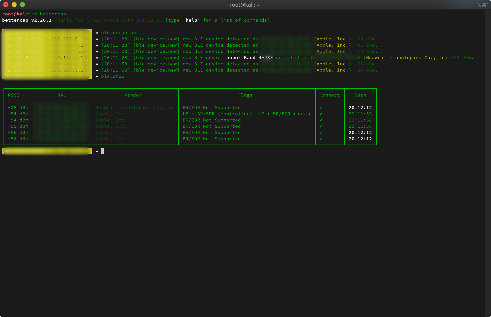
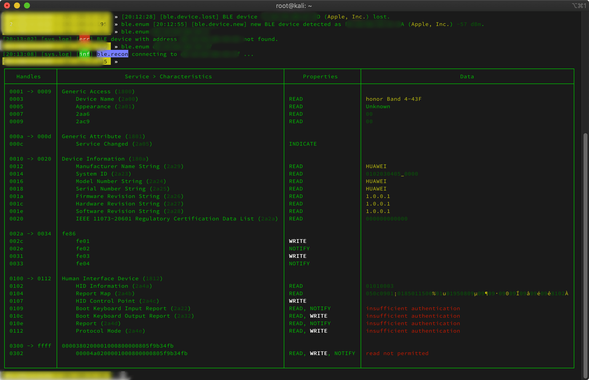

#### How I enter into Bluetooth Low Energy (BLE)?

Heart rate sensors, smart scale, iBeacon etc. And those early startups days. I played
a lot with BLEs for different purposes ( working on prototypes ). Whether to retrive data from sensors
or to connect them with clients like android or iOS devices using their native
SDKs.

And that's the first time I realised. How we can easily connect with any BLEs & played with their data.
Now, it's 2020 and lots of things changed. I come across bettercap a nice tool written in Go. Here I'm covering
how to use bettercap for BLE recon?

Running bettercap on my Raspberry Pi 3. Configured & enabled SSH on top of the Kali Linux.



#### What is BLE or Bluetooth Low Energy?

Bluetooth Low Energy (BLE) is a low power wireless communication technology that can be used over a short distance
to enable smart devices to communicate. Some of the devices you interact with every day such as your smart phone, smart
watch, fitness tracker, wireless headphones and computer are using BLE to create a seamless experience between your devices.

#### What is Bettercap?

Bettercap is a powerful, easily extensible and portable framework written in Go which aims to offer to
security researchers, red teamers and reverse engineers an easy to use, all-in-one solution with all the
features they might possibly need for performing reconnaissance and attacking WiFi networks, Bluetooth
Low Energy devices, wireless HID devices and Ethernet networks.

- WiFi networks scanning, deauthentication attack, clientless PMKID association attack and automatic WPA/WPA2 client handshakes capture.
- Bluetooth Low Energy devices scanning, characteristics enumeration, reading and writing.
- 2.4Ghz wireless devices scanning and MouseJacking attacks with over-the-air HID frames injection (with DuckyScript support).
- Passive and active IP network hosts probing and recon.
- ARP, DNS and DHCPv6 spoofers for MITM attacks on IP based networks.
- Proxies at packet level, TCP level and HTTP/HTTPS application level fully scriptable with easy to implement javascript plugins.
- A powerful network sniffer for credentials harvesting which can also be used as a network protocol fuzzer.
- A very fast port scanner.
- A powerful REST API with support for asynchronous events notification on websocket to orchestrate your attacks easily.
- An easy to use web user interface.
- [More!](https://www.bettercap.org/intro/)

#### Installation

Check the offical docs for [installation](https://www.bettercap.org/installation/)

#### Steps

- Open your command line tool and then type

```
 bettercap
```

- To start Bluetooth Low Energy devices discovery

```
  ble.recon on
```



Now, you can see a list of devices.

- To show discovered Bluetooth Low Energy devices.

```
ble.show
```



- To enumerate services and characteristics for the given BLE device.

```
ble.enum MAC
```



And, here the complete characteristics details of fitness band.

#### List of commands

```
ble.recon on
```

Start Bluetooth Low Energy devices discovery.

```
ble.recon off
```

Stop Bluetooth Low Energy devices discovery.

```
ble.clear
```

Clear all devices collected by the BLE discovery module.

```
ble.show
```

Show discovered Bluetooth Low Energy devices.

```
ble.enum MAC
```

Enumerate services and characteristics for the given BLE device.

```
ble.write MAC UUID HEX_DATA
```

Write the HEX_DATA buffer to the BLE device with the specified MAC address, to the characteristics with the given UUID. |

I only covered discovery part not the data tampering part. Tempering will cover in some other blog.

For more details How to use bettercap? Check official [docs](https://www.bettercap.org/modules/ble/) .

happy hacking :)
