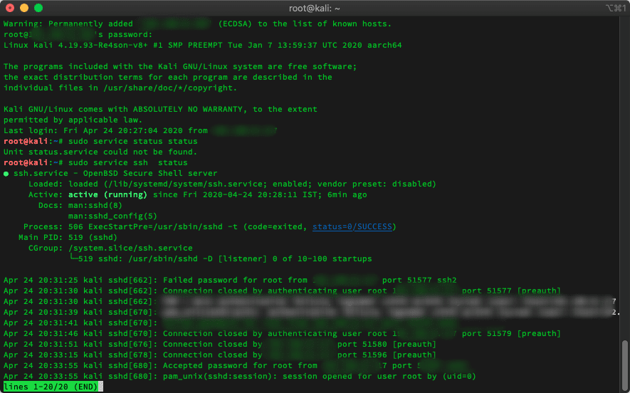
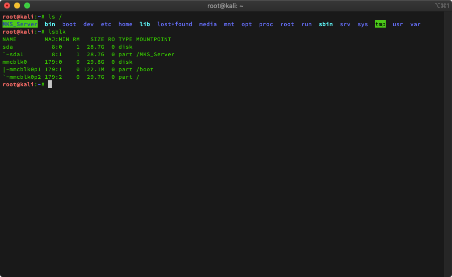
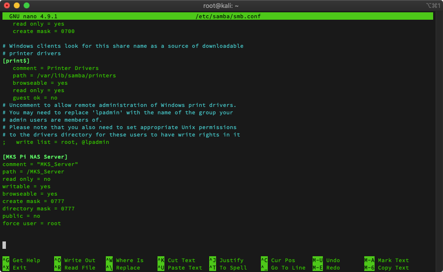
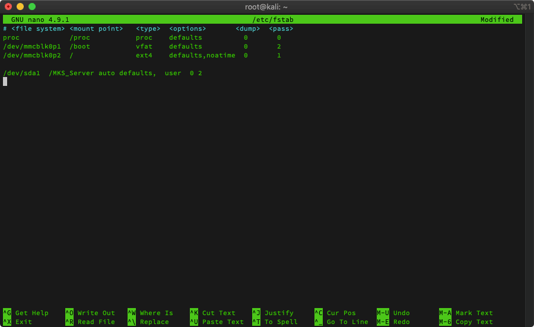
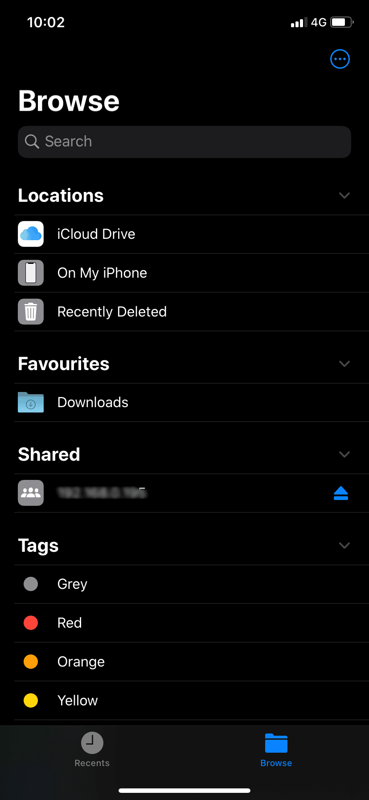
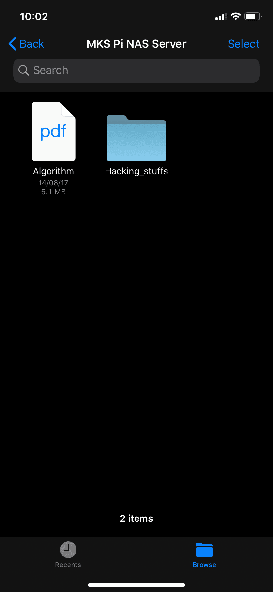

Step by step guide to setup your own NAS using Raspberry Pi. I have divided section
in two parts. First, how to install KALI Linux on Raspberry Pi and enable SSH for remote
access. Second part, covers NAS configuration.


#### Pre-requisites

- Raspberry Pi 3 B (One I'm using)
- Class 10 micro SD card 32 GB
- HDMI monitor, keyboard and mouse (for one time setup)
- [Kali Linux ARM Image](https://www.offensive-security.com/kali-linux-arm-images/#1493408272250-e17e9049-9ce8)
- External hardisk for storage

### Section 1 - Kali Linux Installation

#### Installation & First Boot

- Download Kali Linux Image for the Raspberry Pi
  [Kali Linux ARM Image](https://www.offensive-security.com/kali-linux-arm-images/#1493408272250-e17e9049-9ce8)

- Once the image downloaded. Flash the Image to the Micro SD Card. I used
  [Etcher](https://www.balena.io/etcher/).

  

- Time for first boot. At this point we need HDMI monitor and keyboard. Plug in the power source to boot into Kali Linux
  for the first time. To get to the desktop, default login is "root" with "toor" being the password.

- Update Kali Linux

```
sudo apt-get update &&  sudo apt-get upgrade
sudo apt-get dist-upgrade
```

- Once update completed. Change the root password.

```
passwd root
```

#### SSH configuration

- Change default SSH host keys

```
root@kali:~ rm /etc/ssh/ssh_host_*
root@kali:~ dpkg-reconfigure openssh-server
root@kali:~ service ssh restart
```

- Test SSH working

```
sudo service ssh status
```

- If it's not, then

```
sudo service ssh start
```

- Run the command ifconfig on Pi terminal and get the IP address from there.

```
ifconfig
```

- That's it. Try to connect Pi remotely.

```
ssh root@(IP_address)
```



Now, it's ready for all kinds of pentesting attack.
For wifi related attack one need to attach powerful external
wifi adapter. Not covering adapter list here.

### Section 2 - NAS configuration

#### What is NAS ?

An NAS device is a storage device connected to a network that allows storage and retrieval
of data from a central location for authorised network users and varied clients. NAS devices
are flexible and scale out, meaning that as you need additional storage, you can add to what
you have. NAS is like having a private cloud in the office. It’s faster, less expensive and
provides all the benefits of a public cloud on site, giving you complete control.

#### Steps

- Install following packages to add an support for NTFS and exFAT file systems.

```
sudo apt-get install ntfs-3g
sudo apt-get install exfat-utils exfat-fuse
```

- Install Samba Server

```
sudo apt-get install samba samba-common-bin
```

- Create root directory to mount our external storage.

```
ls /
sudo mkdir /server_name
```

- Make folder accessable

```
sudo chmod 777 /server_name
```

Folder color will change to green.

- Check mounted drive and there connecting point

```
lsblk
```

- Mount the server

```
sudo mount /dev/sda{number} /server_name
```

my server name dir - MKS_Server



- Configure Samba

```
sudo nano /etc/samba/smb.conf
```

At the bottom add following

```
[Server Name]
comment = “anyname”
path = /server_name
browseable = yes
read only = no
writeable= yes
create mask = 0777
directory mask = 0777
public = no
force user = root
```



- Add user to acccess Raspberry PI NAS Server.

```
sudo adduser user_name
```

- Set samba password

```
Sudo smbpasswd – a user_name
```

- Restart Samba server once above steps done.

```
sudo /etc/init.d/smbd restart
sudo /etc/init.d/nmbd restart
```

- When we restart Raspberry Pi. It will unmount the drive. To auto mount drives upon rebooting

```
sudo nano /etc/fstab
```

Add this line

```
/dev/sda1 /server_name auto defaults, user 0 2
```



- Set static IP address

```
sudo nano /etc/dhcpcd.conf
```

```
static ip_address = 192.168.0.23/24
static routers = 192.168.0.1
static domain_name_users = 192.168.0.1
```

- Reboot Pi

```
sudo reboot
```


#### Testing

<div style="display:flex;  flex-direction:row;">
<div style="height:100%;width:100%">



 </div>
<div style="height:100%;width:100%">



</div>
</div>

NAS is ready :-)