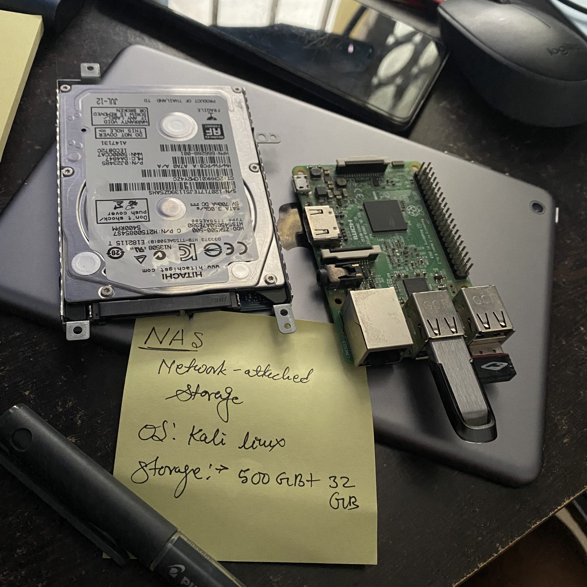
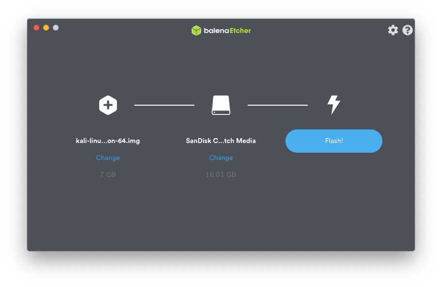

Step by step guide to setup your own NAS using Raspberry Pi. I have divided section
in two parts.First, how to install KALI Linux on Raspberry Pi and enable SSH for remote
access. Second parts, covers NAS configuration.

#### Prerequisite (one I'm using)

- Raspberry Pi 3 B
- Class 10 micro SD card 32 GB
- HDMI monitor, keyboard and mouse (for one time setup)
- [Kali Linux ARM Image](https://www.offensive-security.com/kali-linux-arm-images/#1493408272250-e17e9049-9ce8)
- External hardisk for storage

### Section 1

