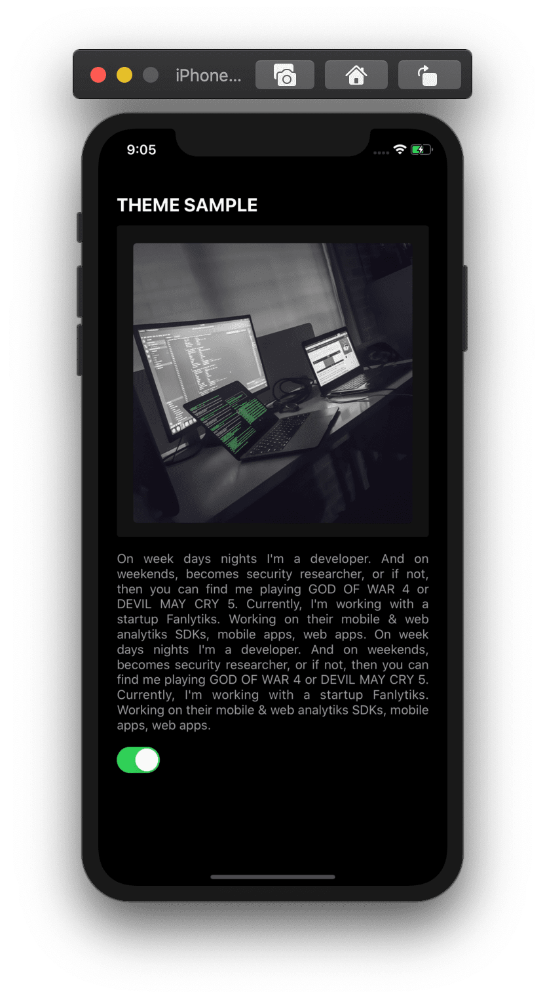
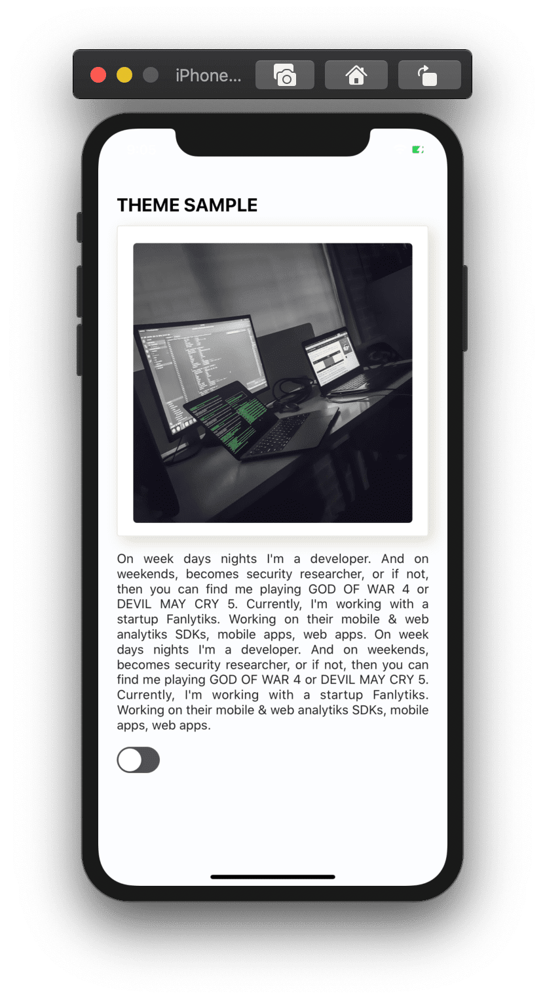

A complete React Native dark theme setup with styled-component + hooks.


<div style="display:flex;  flex-direction:row;">
<div style="height:100%;width:100%">


 </div>
<div style="height:100%;width:100%"> 


</div>
</div>
 

#### Create a new React Native project
```
npx react-native init react-native-dark-theme
```

#### Enter  into project root directory and get the project up and running with
```
npx react-native run-ios
or
npx react-native run-android
```

I'm focusing more on theme setup code. So, get rest of component code from my
[Github](https://github.com/MKS-01/react-native-dark-theme).


#### Install the library using either yarn or npm:
```
yarn add styled-components
yarn add @react-native-community/async-storage
```

From React-Native >= 0.60. Linking the package manually is not required anymore with Autolinking. 

##### Using React Native >= 0.60

* iOS Platform:

CocoaPods on iOS needs this extra step
```
$ cd ios && pod install && cd .. 
```

##### Using React Native < 0.60

Then you  need to link the native parts of the library for the 
platforms you are using. 

```
react-native link @react-native-community/async-storage
```


For Theme detection , I'm using module Appearance. Which comes with react native 0.62.
Currently, it detects the user's preferred color scheme
(light, dark or no-preference) on iOS 13+ and Android 10+.

```JS
import {Appearance} from 'react-native';

const colorScheme = Appearance.getColorScheme();
if (colorScheme === 'dark') {
  // Use dark color scheme
}
```

For React Native < 0.62 one need to setup as per the 
[react-native-appearance](https://github.com/expo/react-native-appearance)


##### Why async-storage?

For below iOS 13 and Android 10 we need to store selected theme mode anywhere 
otherwise whenever user will re-open the app. It will take system default theme mode.

Let's start  with  global aysnc-storage function. ./utils/localStorage.js

```JS
import AsyncStorage from '@react-native-community/async-storage';

export async function storeValue(key, value) {
  try {
    await AsyncStorage.setItem('@' + key, value);

    console.log(key + ' value stored');
  } catch (e) {
    console.log('Unable to stored ' + key);
  }
}

export async function retriveValue(key) {
  try {
    const value = await AsyncStorage.getItem('@' + key);
    if (value !== null) {
      return value;
    }
  } catch (e) {
    console.log(key + ' not  found!');
  }
}

export async function removeValue(key) {
  try {
    await AsyncStorage.removeItem('@' + key);
  } catch (e) {
    // remove error
  }
  console.log('Successfully removed ' + key);
}
```

I'm using hooks + context api to global access the theme property.


To detect default mode 

```JS
const defaultMode =
  Appearance.getColorScheme() === 'no-preference'
    ? 'light'
    : Appearance.getColorScheme();

```


To detect theme mode  based on addChangeListener and  to deal with below iOS 13  and Android 10
```JS

  useEffect(() => {
    let themeMode;

    const themeAysnc = async () => {
      const majorVersionIOS = parseInt(Platform.Version, 10);
    
       themeMode = await retriveValue('themeMode');

      if ((majorVersionIOS < 13 || Platform.Version < 29) && themeMode) {
        setThemeState(themeMode);
      }
    };

    const subscription = Appearance.addChangeListener(({colorScheme}) => {
      setThemeState(colorScheme);
    });

    themeAysnc();

    return () => subscription.remove();
  }, []);
  ```

Styled-component setup. Pass the data through ThemeProvider. Now, all the root component
detects the theme mode.
 
```JS
return (
    <ThemeContext.Provider value={{mode: themeState, setMode}}>
      <ThemeProvider
        theme={themeState === 'dark' ? darkTheme.theme : lightTheme.theme}>
        {children}
      </ThemeProvider>
    </ThemeContext.Provider>
  );
```

Switch to change  theme mode
```JS
import {useTheme} from '../store-context/theme-context';

const SwitchComponent = () => {
  const theme = useTheme();

  return (
    <View>
      <Switch
        ios_backgroundColor="#3e3e3e"
        value={theme.mode === 'dark'}
        onValueChange={(value) => theme.setMode(value ? 'dark' : 'light')}
      />
    </View>
  );
};
```

Let's combine code together ./theme-context.js. To detect and store theme mode.
```JS
import React, {createContext, useState, useEffect} from 'react';
import {ThemeProvider} from 'styled-components/native';
import {Appearance} from 'react-native';
import {lightTheme, darkTheme} from '../styles/theme';
import {storeValue, retriveValue} from '../utils/localStrorage';
import {Platform} from 'react-native';

const defaultMode =
  Appearance.getColorScheme() === 'no-preference'
    ? 'light'
    : Appearance.getColorScheme();

const ThemeContext = createContext({
  mode: defaultMode,
  setMode: (mode) => console.log(mode),
});

export const useTheme = () => React.useContext(ThemeContext);

export const ManageThemeProvider = ({children}) => {
  const [themeState, setThemeState] = useState(defaultMode);

  const setMode = (mode) => {
    setThemeState(mode);
    storeValue('themeMode', mode);
  };

  useEffect(() => {
    let themeMode;

    const themeAysnc = async () => {
      const majorVersionIOS = parseInt(Platform.Version, 10);

      themeMode = await retriveValue('themeMode');

      if ((majorVersionIOS < 13 || Platform.Version < 29) && themeMode) {
        setThemeState(themeMode);
      }
    };

    const subscription = Appearance.addChangeListener(({colorScheme}) => {
      setThemeState(colorScheme);
    });

    themeAysnc();

    return () => subscription.remove();
  }, []);

  return (
    <ThemeContext.Provider value={{mode: themeState, setMode}}>
      <ThemeProvider
        theme={themeState === 'dark' ? darkTheme.theme : lightTheme.theme}>
        {children}
      </ThemeProvider>
    </ThemeContext.Provider>
  );
};

```


Called ManageThemeProvider at the root of the Entry file.

```JS
import {ManageThemeProvider} from './store-context/theme-context';


const App = () => {
  return (
 <ManageThemeProvider>
      <RootSafeAreaView>
        <RootView>
          <TitleView>
            <TitleText>THEME SAMPLE</TitleText>
          </TitleView>
       {/*get the rest  code from repo*/}
          <SwitchComponent />
        </RootView>
      </RootSafeAreaView>
    </ManageThemeProvider>
      );
};
```

css
```JS
import styled from 'styled-components/native';
import {scaleSize} from './mixins';

export const RootSafeAreaView = styled.SafeAreaView`
  flex: 1;
  background-color: ${(props) => props.theme.background};
  justify-content: center;
`;

export const RootView = styled.View`
  flex: 1;
  background-color: ${(props) => props.theme.rootBackground};
  padding: ${scaleSize(20)}px;
`;

export const TitleText = styled.Text`
  color: ${(props) => props.theme.text};
  font-size: ${22}px;
  font-weight: bold;
`;

{/*.....*/}
`;

```

And don't forget to setup your own set of dark and light theme.


```JS
//theme.js
export const lightTheme = {
  theme: {
    background: '#fcfdff',
    rootBackground: '#fcfdff',
    cardBackground: '#ffffff',
    cardBorder: '#ede8df',
    text: '#000000',
  },
};

export const darkTheme = {
  theme: {
    background: '#000000',
    rootBackground: '#000000',
    cardBackground: '#121212',
    cardBorder: 'transparent',
    text: '#ffffff',
    },
};

```

Now, kill the active server and run it once again.
```
npx react-native run-ios
or
npx react-native run-android
```

For the complete code check 
[Github](https://github.com/MKS-01/react-native-dark-theme).