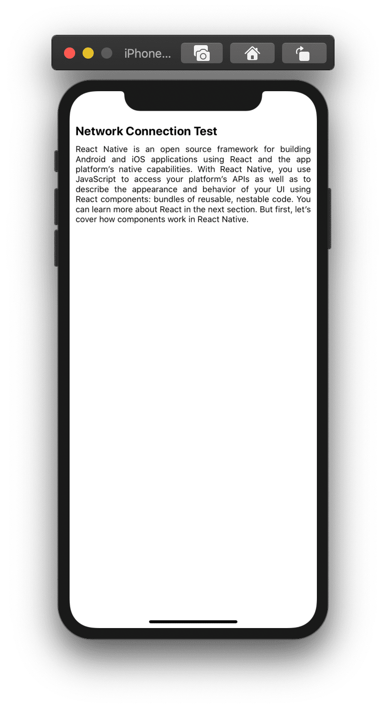
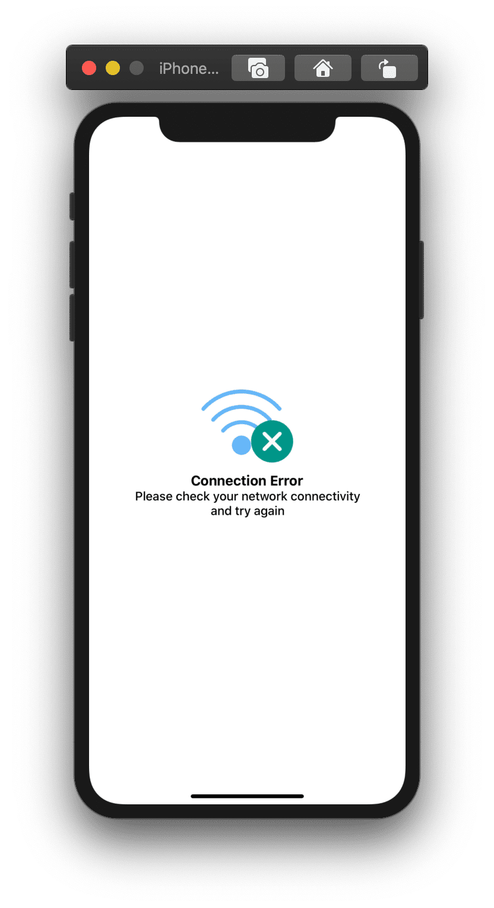

How to deal with internet connection on react-native mobile app? Since react-native
don't come with default setup. Let's do it
 

<div style="display:flex;  flex-direction:row;">

<div style="height:100%;width:100%">


 </div>
<div style="height:100%;width:100%"> 


</div>
</div>


#### Create a new React Native project
```
npx react-native init react-native-network-error
```

#### Enter  into project root directory and get the project up and running with
```
npx react-native run-ios
or
npx react-native run-android
```


I'm not gonna to cover any design part here. One can get code from my
[Github](https://github.com/MKS-01/react-native-network-error).

To detect network connection I'm using 
[react-native-netinfo](https://github.com/react-native-community/react-native-netinfo) 
supports both iOS and Android.

#### Install the library using either Yarn:

```
yarn add @react-native-community/netinfo
```

 or  npm:

```
npm install --save @react-native-community/netinfo
```

From React-Native >= 0.60. Linking the package manually is not required anymore with Autolinking. 

##### Using React Native >= 0.60

* iOS Platform:

CocoaPods on iOS needs this extra step
```
$ cd ios && pod install && cd .. 
```

##### Using React Native < 0.60

Then you  need to link the native parts of the library for the platforms you are using. 

```
react-native link @react-native-community/netinfo
```

Import the library:

```JS
import NetInfo from "@react-native-community/netinfo";
```

Subscribe to network state updates:
```JS
// Subscribe
const unsubscribe = NetInfo.addEventListener(state => {
  console.log("Connection type", state.type);
  console.log("Is connected?", state.isConnected);
});

// Unsubscribe
unsubscribe();
```

I'm using functional component. To store data I'm using hooks.
```JS
const [netInfo, setNetInfo] = useState(currentNetwork);
```

Let's combine all the code together inside  ./utils/ConnectionCheck.js dedicated
file to store connection 
function.

```JS
import {useState, useEffect} from 'react';
import NetInfo from '@react-native-community/netinfo';

let currentNetwork;

NetInfo.fetch().then((state) => {
  currentNetwork = state.isConnected;
});

const CheckConnection = () => {
  const [netInfo, setNetInfo] = useState(currentNetwork);

  useEffect(() => {
    const unsubscribe = NetInfo.addEventListener((state) => {
      // console.log("Connection type", state.type);
      // console.log("Is connected?", state.isConnected);
      setNetInfo(state.isConnected);
    });
    return () => unsubscribe();
  }, []);

  return netInfo;
};

export default CheckConnection;
```

Go to index.js or root screen of your app and then import CheckConnection 
and set  component for no network as per the below code.


```JS
import React from 'react';
import {View, Text, SafeAreaView, StyleSheet, Image} from 'react-native';
import CheckConnection from './utils/CheckConnetion';

const ErrorCard = () => {
  return (
    <View style={styles.errorContainer}>
    {/*check github repo for design*/}
    </View>
  );
};

const NetworkTest = () => {
  let network = CheckConnection();
  if (network === false) {
    return <ErrorCard />;
  }
  return (
    <SafeAreaView style={styles.rootView}>
      <View style={styles.rootContainer}>
      {/*...
            rest of component
           ...*/}
      </View>
    </SafeAreaView>
  );
};

export default NetworkTest;

```

And that's it. Run your app and test it.
```
npx react-native run-ios
or
npx react-native run-android
```
One can get complete  code at  [Github](https://github.com/MKS-01/react-native-network-error).

Happy Coding :-)


